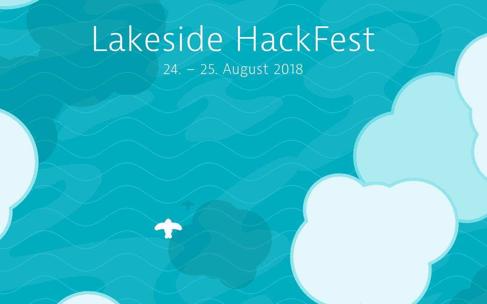

# How to Train Our Future Overlords

This is a task-based approach to getting an overview over the current (computer vision) machine learning landscape! Check out the branches of the repository, the explanations, links, and tasks in the [computer.vision.ipynb](computer.vision.ipynb). 

# Setup

Once Python 3.6 is installed, `pip3 install -r requirements.txt` should set up the rest for the notebook. 

# Start

Run `jupyter notebook` from the source directory. 

~~~
$ cd computer.vision.101
$ jupyter notebook
~~~

# Start with Docker

Work in Progress

ToDo:

* Start with a volume to persist changes within the notebook and other files
* Automatically switch to the user that supplied the source files

1. Build: ``docker build --rm -t chkr/computer.vision.101:1.0 .``
1. Run: ``docker run -p 8888:8888 -it chkr/computer.vision.101:1.0 jupyter notebook --no-browser --port 8888 --ip 0.0.0.0 --allow-root``

# License 

MIT